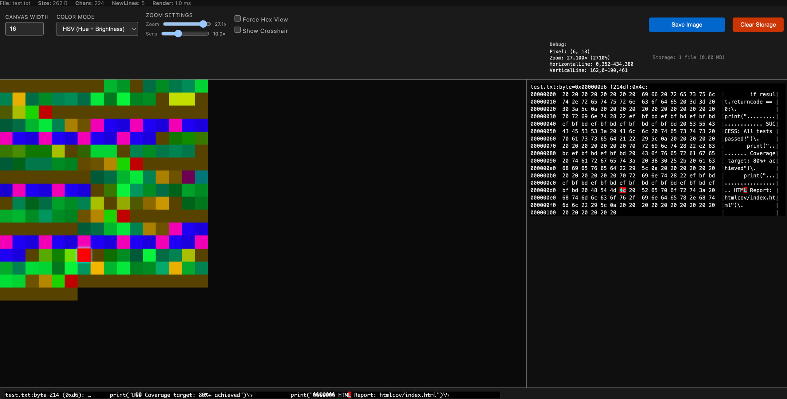
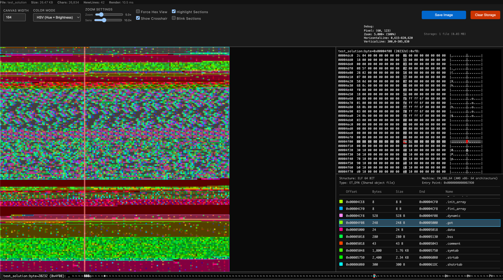
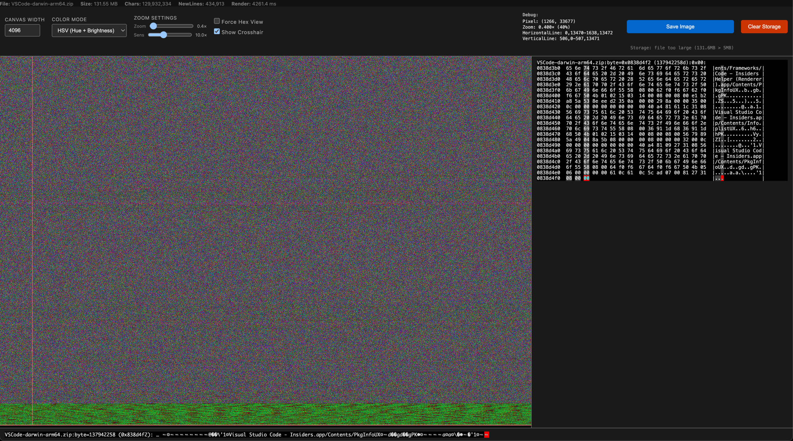

# FileScope

**Standalone pixel-view-based file analyser and dissector**

By techn0z0ne (somedudefrom2021@gmail.com), 2025

## Overview

FileScope is a browser-based file visualization tool that renders binary files as pixel grids, providing visual analysis and hex inspection capabilities.  
  
Currently it includes specialized support for ELF binary format analysis  
(based on Based on Bastian Molkenthin aka Sunshine2k project) with section detection and interactive navigation.

## Features

- **Visual Binary Analysis**: Renders any file as a pixel grid with adjustable width
- **Color Modes**: HSV (hue + brightness) and grayscale rendering
- **Zoom & Pan**: Interactive canvas with zoom up to 30× and scroll tracking
- **Hex View**: Real-time hex dump with byte inspection
- **ELF Format Support**:
  - Automatic ELF detection (32-bit)
  - Section boundary visualization with colored overlays
  - Interactive section list with offset/size details
  - Bidirectional navigation (click pixel → highlight section, click section → jump to byte)
  - Header/program header/section header identification
- **Crosshair & Pixel Marker**: Visual feedback for byte selection
- **Performance Optimized**: Debounced rendering with optional overlay blinking

## Screenshots

### Text File Visualization

*Text file rendered in HSV mode showing character patterns*

### ELF Binary Analysis

*ELF executable with section overlays and structure panel*

### Binary File Visualization

*Binary file with visual entropy patterns (up to 250mb currently)*

## Usage

1. Open `FileScope.html` in a modern web browser
2. Drag and drop any file onto the page
3. Use canvas width slider to adjust visualization dimensions
4. Click any pixel to inspect byte value and hex context
5. For ELF files:
   - Toggle "Highlight Sections" to show/hide overlays
   - Toggle "Blink Sections" for animated borders
   - Click sections in right panel to navigate
   - Click canvas pixels to highlight corresponding section

## Controls

- **Canvas Width**: Adjust pixel grid width (1-64000)
- **Color Mode**: Switch between HSV and Grayscale rendering
- **Zoom**: 0.1× to 30× with mouse wheel (Ctrl/Cmd + scroll)
- **Zoom Sensitivity**: Adjust zoom speed
- **Force Hex View**: Override auto-detection for text files
- **Show Crosshair**: Toggle visual pixel selection aid
- **Highlight Sections** (ELF): Show section boundary overlays
- **Blink Sections** (ELF): Animate section borders

## Technical Details

- Pure HTML5/JavaScript implementation (no dependencies)
- Canvas2D rendering with `desynchronized` context for performance
- ELF parser integrated from OnlineElfViewer project
- Supports files up to browser memory limits
- IndexedDB storage for file persistence

## ELF Format Support

Currently supports:
- 32-bit ELF executables
- Little-endian and big-endian formats
- Common architectures (x86, ARM, Xtensa, etc.)
- Section header parsing
- Program header parsing

Limitations:
- Limited 64-bit ELF support
- No symbol table resolution (future enhancement)

## Performance Notes

For large ELF files with many sections, overlay rendering can create thousands of DOM elements. Use the performance controls:
- Disable "Blink Sections" (default off) to reduce animation overhead
- Disable "Highlight Sections" temporarily during zoom operations
- See `perf_plan.md` for optimization roadmap

## Files

- `FileScope.html` - Main HTML interface
- `FiloScope.js` - Core visualization and ELF parsing logic
- `OnlineElfViewer/` - Integrated ELF parser library
- `perf_plan.md` - Performance optimization roadmap
- `preview_*.jpg` - Documentation screenshots

## Browser Compatibility

Tested on:
- Chrome/Edge (recommended)
- Firefox
- Safari

Requires modern browser with:
- Canvas2D API
- ES6+ JavaScript
- FileReader API
- IndexedDB

## License

Non-military license for peaceful projects (based on BSD 3-Clause)

Copyright (c) 2025 techn0z0ne (somedudefrom2021@gmail.com). All Rights Reserved.

This software is not licensed and not intended for use in the design, construction, operation or maintenance of any military facilities or systems, military research, development of military systems, weapons, or systems designed for intentional harming.

See `FileScope.html` header for full license text.

